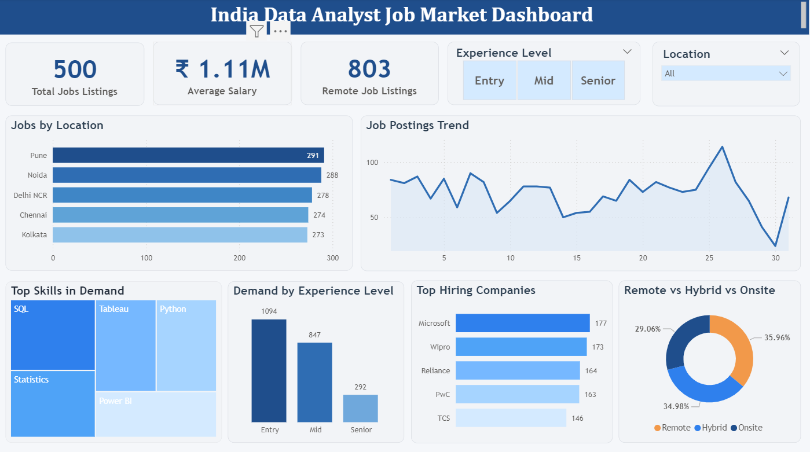

# Data Analyst Job Trends Dashboard (Power BI)

## 📊 Overview
This project presents a Power BI dashboard analyzing data analyst job postings to identify demand trends, required skills, locations, and salary insights.

## 🎯 Objective
To understand the job market for data analysts and identify in-demand skills and hiring patterns.

## 🚀 Key Insights
- Most in-demand skills (SQL, Excel, Power BI)  
- Top hiring locations  
- Job role distribution  
- Salary trends  

## 📈 Features
- Skill demand analysis  
- Location-wise job distribution  
- Salary insights  
- Role-based trends  
- Interactive filters  

## 🛠 Tools & Skills Used
- Power BI  
- Data Analysis  
- Data Visualization  
- DAX  

## 📁 Dataset
The dataset used for this project is included in the repository.

## 📷 Dashboard Preview

## 📥 Download Files
- [Download PBIX File](Job_Market_Dashboard.pbix)  
- [Download Dataset](India_Data_Analyst_Jobs_Dataset.csv)

## 💡 Conclusion
This dashboard provides insights into job market trends and helps identify key skills required for data analyst roles.
